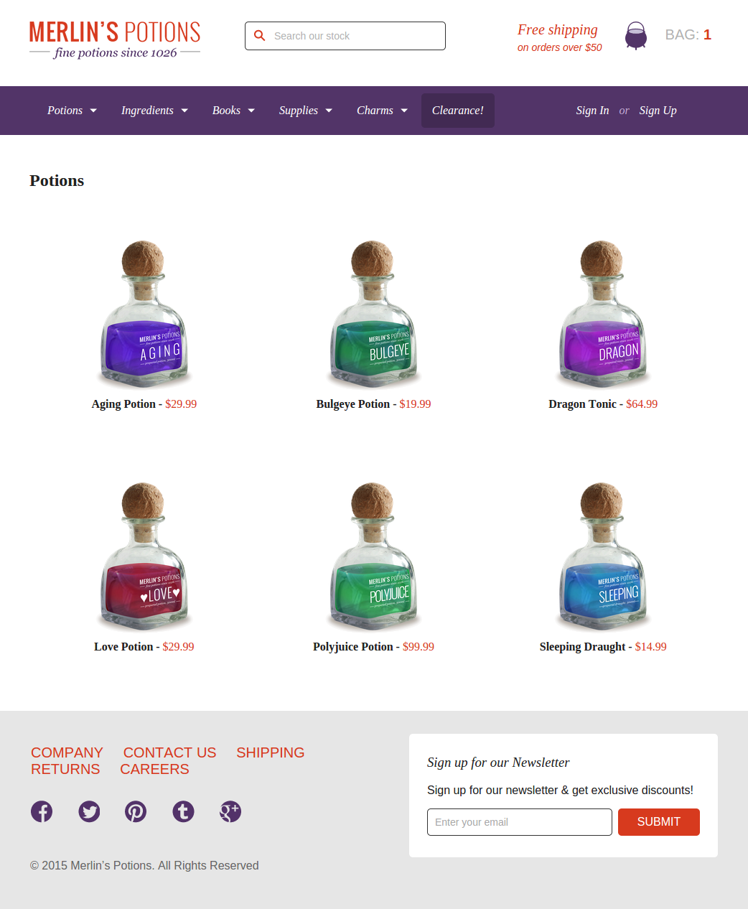

# Merlin's Potion Website
Para rodar abra com o sublime, qua já vem com o Browser Sunc instalado.
No menu "Browser Sync" selecionar "Launch".

Atenção: os produtos não carregam se rodar do file system. Tem que ser de um servidor.

